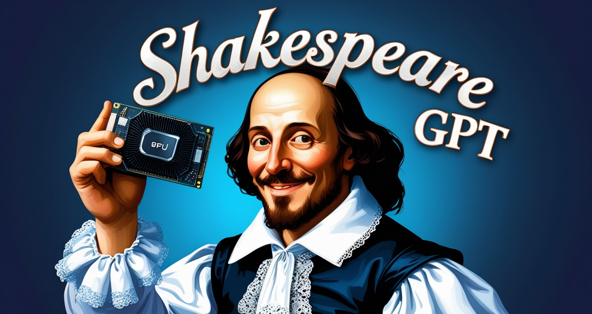

# Shakespeare GPT (Shakespearean Text Generation Prompts)

Welcome to what might be the internet's largest collection of prompts for rewriting text in Shakespearean English! This repository contains a variety of prompts designed to transform modern text into the style of Shakespeare, organized by format and purpose.

These prompts can be used with any AI tool that accepts custom instructions. A user interface may be forthcoming for those who feel the need to do this regularly.

## Repository Structure

### [Basic Transformation](basic-transformation/)
- [Foundational](basic-transformation/foundational.md) - The core prompt for transforming any text into Shakespearean style

### [Business Tools](business-tools/)
- [Calendar Descriptions](business-tools/cal-descriptions.md) - Transform calendar event descriptions
- [Job Descriptions](business-tools/job-description.md) - Create Shakespearean job postings
- [Out of Office Responses](business-tools/oof-responses.md) - Craft eloquent absence notifications
- [Rewrite Templates](business-tools/rewrite-templates.md) - General business text transformation templates
- [RFP Generator](business-tools/rfp-generator.md) - Create Request for Proposals in Shakespearean style
- [Meeting Materials](business-tools/meetings/) - Transform meeting agendas and minutes

### [By Format](by-format/)
Prompts organized by content format:

#### [Classifieds](by-format/classifieds/)
- [Classified Ads](by-format/classifieds/classifieds.md) - Transform classified advertisements

#### [Email](by-format/email/)
- [Business Email](by-format/email/business-email.md) - General business email transformation
- [Business Enquiries](by-format/email/business-enquiries.md) - Professional inquiry emails
- [Casual Email](by-format/email/casual-email.md) - Informal correspondence
- [RFQ Sender](by-format/email/rfq-sender.md) - Request for Quotation emails

#### [Invitations](by-format/invitations/)
- [Invitations](by-format/invitations/invitations.md) - Event invitations in Shakespearean style

#### [Itinerary](by-format/itinerary/)
- [Creator](by-format/itinerary/creator.md) - Transform travel itineraries

#### [Newsletter](by-format/newsletter/)
- [Email Newsletter](by-format/newsletter/email-newsletter.md) - Transform email newsletters
- [Family Newsletters](by-format/newsletter/family-newsletters.md) - Family updates in Shakespearean style

#### [Notes](by-format/notes/)
- [Internal Memo](by-format/notes/internalmemo.md) - Office memoranda
- [Notes to Self](by-format/notes/nts.md) - Personal reminders

#### [Shopping List](by-format/shopping-list/)
- [Generator](by-format/shopping-list/generator.md) - Create Shakespearean shopping lists

#### [Social Media](by-format/social-media/)
- [Facebook](by-format/social-media/facebook/) - Posts and comments
- [LinkedIn](by-format/social-media/linkedin/) - Professional profiles and posts
- [Reddit](by-format/social-media/reddit/) - Posts and comments
- [X/Twitter](by-format/social-media/x/) - Tweet transformations
- [YouTube](by-format/social-media/youtube/) - Video descriptions
- [Other Platforms](by-format/social-media/other/) - Additional social media formats

#### [To-Dos](by-format/to-dos/)
- [List Creator](by-format/to-dos/list-creator.md) - Task lists in Shakespearean style

### [By Purpose](by-purpose/)
Prompts organized by their intended use:

#### [Accounting](by-purpose/accountants.md)
- Financial document transformation

#### [Blogs](by-purpose/blogs/)
- [Blog Outline](by-purpose/blogs/blog-outline.md) - Structure blog posts
- [Blog Writer](by-purpose/blogs/blog-writer.md) - Create full blog content

#### [Copywriting](by-purpose/copywriting/)
- [Bio Writer](by-purpose/copywriting/bio-writer.md) - Personal and professional biographies
- [Descriptions](by-purpose/copywriting/descriptions.md) - General descriptive text
- [Landing Page](by-purpose/copywriting/landing-page.md) - Website landing pages
- [Menu Text](by-purpose/copywriting/menu-text.md) - Restaurant and service menus
- [Product Text](by-purpose/copywriting/product-text.md) - Product descriptions
- [Website Copy](by-purpose/copywriting/website-copy.md) - General website content

#### [Documentation](by-purpose/documentation/)
- [Docs Writer](by-purpose/documentation/docs-writer.md) - Technical documentation

#### [Email Correspondence](by-purpose/email-correspondence/)
- [Sales Email Replies](by-purpose/email-correspondence/sales-email-replies.md) - Responses to sales inquiries

#### [For AI](by-purpose/for-ai/)
- [System Prompts](by-purpose/for-ai/system-prompts.md) - AI system instructions
- [Text to Image](by-purpose/for-ai/text-to-image.md) - Image generation prompts
- [User Prompt](by-purpose/for-ai/user-prompt.md) - User instructions for AI

#### [GitHub](by-purpose/github/)
- [README](by-purpose/github/readme.md) - Repository documentation

#### [Grant Writing](by-purpose/grant-writing/)
- [General](by-purpose/grant-writing/general.md) - Grant proposals and applications

#### [Job Seekers](by-purpose/jobseekers/)
- [Cold Outreach](by-purpose/jobseekers/cold-outreach.md) - Networking messages
- [Cover Letters](by-purpose/jobseekers/cover-letters.md) - Job application cover letters
- [Resumes](by-purpose/jobseekers/resumes.md) - CV and resume content

#### [Online Writing](by-purpose/other-online-writing/)
- [Online Comments](by-purpose/other-online-writing/online-comments.md) - Forum and article comments
- [Online Reviews](by-purpose/other-online-writing/online-reviews.md) - Product and service reviews

#### [Productivity](by-purpose/productivity/)
- [Todos](by-purpose/productivity/todos.md) - Task management

#### [Script](by-purpose/script/)
- [Video Script](by-purpose/script/video-script.md) - Scripts for video content

#### [Tech](by-purpose/tech/)
- [Bug Reports](by-purpose/tech/bug-reports.md) - Software issue reporting
- [Feature Requests](by-purpose/tech/feature-requests.md) - Software enhancement proposals
- [Support Tickets](by-purpose/tech/support-tickets.md) - Technical support requests

#### [Technical Writing](by-purpose/tech-writing/)
- [API Docs](by-purpose/tech-writing/api-docs.md) - API documentation
- [User Docs](by-purpose/tech-writing/user-docs.md) - User manuals and guides

#### [Text-to-Speech](by-purpose/tts/)
- [TTS Text](by-purpose/tts/to-tts-text.md) - Content optimized for text-to-speech systems

### [Miscellaneous](misc/)
- [Messages to Friends](misc/messages-to-friends.md) - Personal communications
- [Mission Statements](misc/mission-statements.md) - Organizational purpose statements
- [Prose Converter](misc/prose-converter.md) - General prose transformation
- [Recipes](misc/recipes.md) - Cooking instructions in Shakespearean style

## How to Use

1. Choose a prompt that matches your content type or purpose
2. Copy the prompt text
3. Paste it into your preferred AI tool
4. Provide your original text as instructed
5. Enjoy your Shakespearean transformation!
 
